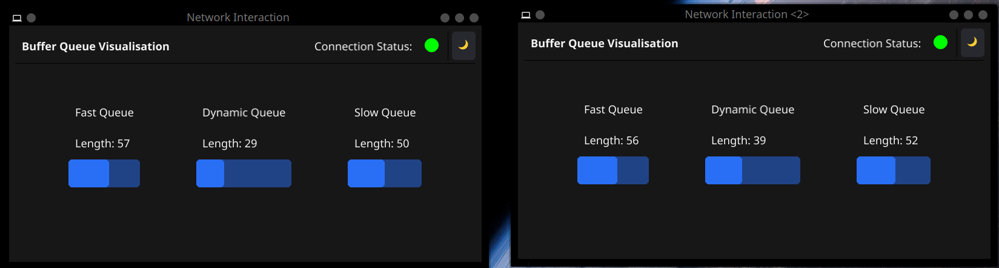

# Network Interaction in Golang

This project represents our study project I and is a desktop application with which two devices can be connected and
communicate with each other via the network. The focus will be on reader-writer problems and the resulting delays when
sending/receiving packets via a TCP connection.

## Features

- Network Connection of two devices
- Automatic detection of the other device on local network
- Automatic connection trying to connect to the other device
- Sending and receiving of packets automatically
- Sending of packets with different delays
  - Fast (0ms)
  - Dynamic (random between 0 and 1000ms)
  - Slow (1000ms)
- Visualization of received packets
- Connection status LED
- Dark mode
- Fullscreen mode
- Cross-platform

## Screenshots
### Disconnected Status


### Connected Status



## Prerequisites

If you want to build the project yourself, install the following dependencies:

```bash
sudo apt install libvulkan-dev libxkbcommon-x11-dev libx11-xcb-dev libegl1-mesa-dev libwayland-dev libx11-dev libxcursor-dev libxfixes-dev pkg-config
```

## Installation

Download the executable for your operating system of choice!
After successfully downloading it just execute it on two devices and have fun!

## Important Note

The backend expects to receive **raw TCP packets**. It does **not** use a protocol like HTTP or MQTT. Instead, the payload of each TCP packet is parsed as a string and processed accordingly.

You can manually send TCP packets to the backend using a tool like `nc` (Netcat). For example:

```bash
echo -n "fast" | nc 127.0.0.1 56867
echo -n "dynamic" | nc 127.0.0.1 56867
echo -n "slow" | nc 127.0.0.1 56867
```

## Authors

- [@Alexander Betke](https://www.github.com/alexinabox)
- [@Theo Leuthardt](https://www.github.com/theoleuthardt)
